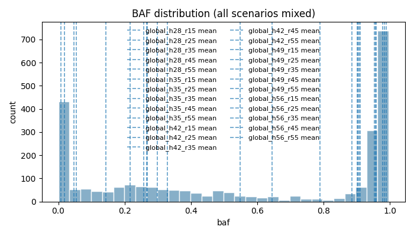
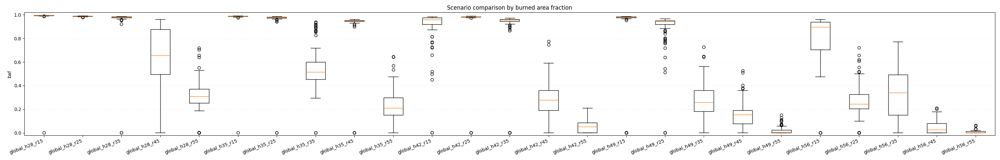
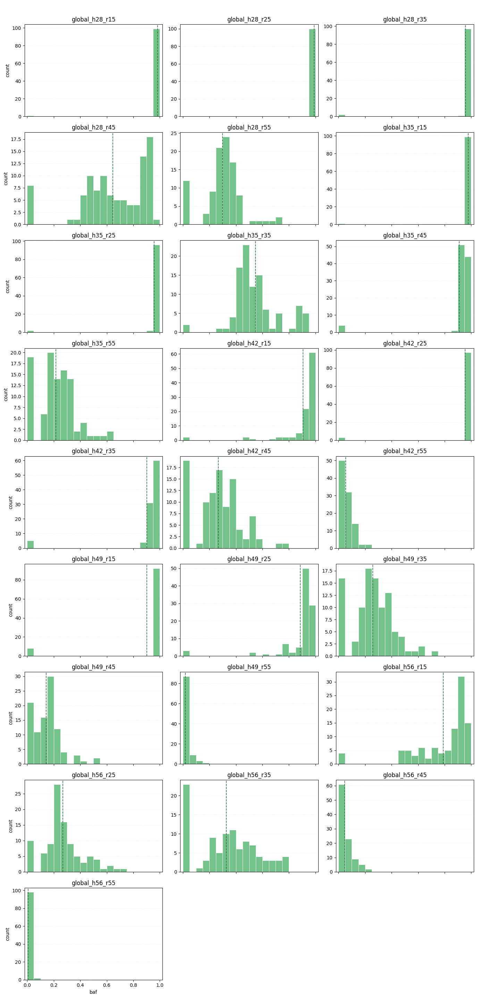
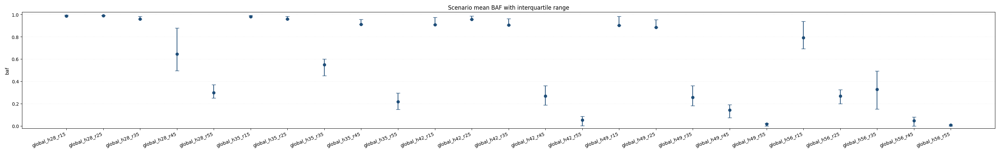
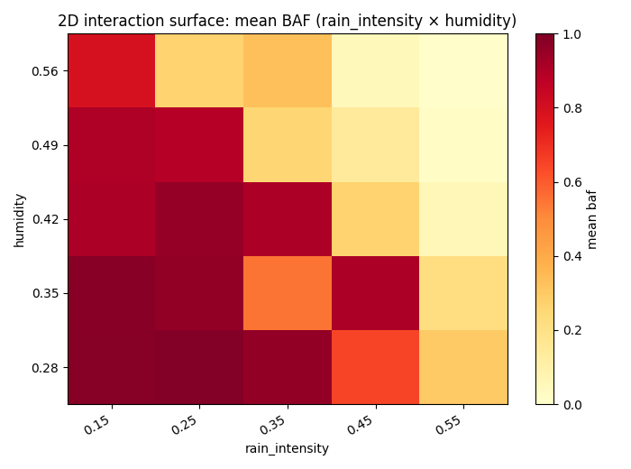
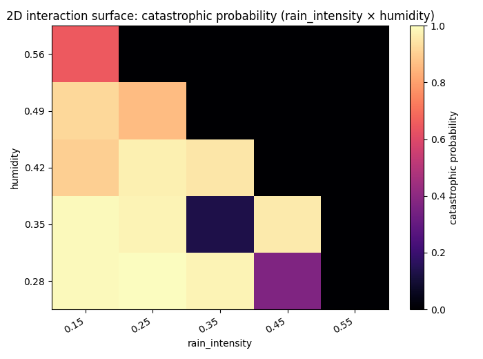

# Forest fire experiments report

## Overall
- Total runs: 2500
- Mean burned area fraction (all / uncensored): 0.5688 / 0.5688
- Mean auc_normalized (all / uncensored): 0.0108 / 0.0108
- Mean time_to_extinguish (all / uncensored): 129.8244 / 129.8244
- Survival median time_to_extinguish (KM, right-censored by max_steps): 128.0000 (reached=True)
- Survival probability P(TTE > 200): 0.1344
- Critical share (all / uncensored): 0.4660 / 0.4660
- BAF quantiles p25/p50/p75/p95: 0.1659 / 0.6120 / 0.9760 / 0.9914
- Burned area p95/p99: 0.9914 / 0.9946
- Critical BAF threshold used: 0.8000
- Catastrophic probability (baf >= 0.8000): 0.4660
- Scenario ranking metric: auc_normalized_mean
- Censored runs (truncated by max_steps): 0 (0.0000)
- Pairwise significance tests: 265 / 300 significant pairs for baf; 289 / 300 for auc_normalized (BH q<=0.05).
- Note: censored runs can bias metrics: fire_duration and AUC are typically underestimated, while BAF-related risk can be understated when fire is still active at truncation.

## Worst scenarios by Mean auc_normalized (normalized)
- global_h28_r15: 0.0273
- global_h28_r25: 0.0234
- global_h42_r25: 0.0221

## Censoring max_steps bias audit
- Target rule: censored_share < 0.0200
- Initial max_steps: 500
- Final max_steps: 500
- Stop reason: target_met

## Absolute KPI ranking
### Mean burned area fraction (absolute, point estimate)
- global_h28_r25: 0.9892
- global_h28_r15: 0.9837
- global_h35_r15: 0.9783
### KPI comparison by scenario (all / uncensored)
- global_h28_r15: baf=0.9837/0.9837, auc_normalized=0.0273/0.0273, time_to_extinguish=103.6500/103.6500, critical=0.9900/0.9900, censored_share=0.0000, baf_q(p25/p50/p75/p95)=0.9927/0.9938/0.9946/0.9958
- global_h28_r25: baf=0.9892/0.9892, auc_normalized=0.0234/0.0234, time_to_extinguish=119.7900/119.7900, critical=1.0000/1.0000, censored_share=0.0000, baf_q(p25/p50/p75/p95)=0.9881/0.9896/0.9907/0.9923
- global_h28_r35: baf=0.9582/0.9582, auc_normalized=0.0173/0.0173, time_to_extinguish=150.5200/150.5200, critical=0.9800/0.9800, censored_share=0.0000, baf_q(p25/p50/p75/p95)=0.9746/0.9801/0.9829/0.9853
- global_h28_r45: baf=0.6447/0.6447, auc_normalized=0.0096/0.0096, time_to_extinguish=178.2900/178.2900, critical=0.3700/0.3700, censored_share=0.0000, baf_q(p25/p50/p75/p95)=0.4969/0.6565/0.8778/0.9342
- global_h28_r55: baf=0.2994/0.2994, auc_normalized=0.0066/0.0066, time_to_extinguish=106.6300/106.6300, critical=0.0000/0.0000, censored_share=0.0000, baf_q(p25/p50/p75/p95)=0.2522/0.3101/0.3716/0.5314
- global_h35_r15: baf=0.9783/0.9783, auc_normalized=0.0217/0.0217, time_to_extinguish=129.3400/129.3400, critical=0.9900/0.9900, censored_share=0.0000, baf_q(p25/p50/p75/p95)=0.9864/0.9888/0.9906/0.9921
- global_h35_r25: baf=0.9573/0.9573, auc_normalized=0.0156/0.0156, time_to_extinguish=173.1600/173.1600, critical=0.9800/0.9800, censored_share=0.0000, baf_q(p25/p50/p75/p95)=0.9728/0.9789/0.9826/0.9852
- global_h35_r35: baf=0.5477/0.5477, auc_normalized=0.0113/0.0113, time_to_extinguish=137.9200/137.9200, critical=0.1300/0.1300, censored_share=0.0000, baf_q(p25/p50/p75/p95)=0.4525/0.5142/0.6005/0.8978
- global_h35_r45: baf=0.9100/0.9100, auc_normalized=0.0151/0.0151, time_to_extinguish=157.7600/157.7600, critical=0.9600/0.9600, censored_share=0.0000, baf_q(p25/p50/p75/p95)=0.9437/0.9483/0.9544/0.9599
- global_h35_r55: baf=0.2171/0.2171, auc_normalized=0.0037/0.0037, time_to_extinguish=130.2500/130.2500, critical=0.0000/0.0000, censored_share=0.0000, baf_q(p25/p50/p75/p95)=0.1512/0.2117/0.2986/0.4304
- global_h42_r15: baf=0.9065/0.9065, auc_normalized=0.0121/0.0121, time_to_extinguish=219.6800/219.6800, critical=0.9000/0.9000, censored_share=0.0000, baf_q(p25/p50/p75/p95)=0.9183/0.9585/0.9745/0.9787
- global_h42_r25: baf=0.9538/0.9538, auc_normalized=0.0221/0.0221, time_to_extinguish=118.9200/118.9200, critical=0.9700/0.9700, censored_share=0.0000, baf_q(p25/p50/p75/p95)=0.9811/0.9831/0.9854/0.9876
- global_h42_r35: baf=0.9030/0.9030, auc_normalized=0.0142/0.0142, time_to_extinguish=170.3100/170.3100, critical=0.9500/0.9500, censored_share=0.0000, baf_q(p25/p50/p75/p95)=0.9460/0.9547/0.9615/0.9655
- global_h42_r45: baf=0.2671/0.2671, auc_normalized=0.0051/0.0051, time_to_extinguish=116.3600/116.3600, critical=0.0000/0.0000, censored_share=0.0000, baf_q(p25/p50/p75/p95)=0.1905/0.2773/0.3612/0.5369
- global_h42_r55: baf=0.0548/0.0548, auc_normalized=0.0015/0.0015, time_to_extinguish=68.4200/68.4200, critical=0.0000/0.0000, censored_share=0.0000, baf_q(p25/p50/p75/p95)=0.0024/0.0536/0.0862/0.1299
- global_h49_r15: baf=0.9010/0.9010, auc_normalized=0.0189/0.0189, time_to_extinguish=127.9400/127.9400, critical=0.9200/0.9200, censored_share=0.0000, baf_q(p25/p50/p75/p95)=0.9761/0.9799/0.9829/0.9847
- global_h49_r25: baf=0.8851/0.8851, auc_normalized=0.0123/0.0123, time_to_extinguish=202.6000/202.6000, critical=0.8600/0.8600, censored_share=0.0000, baf_q(p25/p50/p75/p95)=0.9204/0.9434/0.9517/0.9622
- global_h49_r35: baf=0.2576/0.2576, auc_normalized=0.0052/0.0052, time_to_extinguish=116.1000/116.1000, critical=0.0000/0.0000, censored_share=0.0000, baf_q(p25/p50/p75/p95)=0.1828/0.2597/0.3608/0.4866
- global_h49_r45: baf=0.1442/0.1442, auc_normalized=0.0032/0.0032, time_to_extinguish=99.2400/99.2400, critical=0.0000/0.0000, censored_share=0.0000, baf_q(p25/p50/p75/p95)=0.0766/0.1531/0.1921/0.3618
- global_h49_r55: baf=0.0183/0.0183, auc_normalized=0.0007/0.0007, time_to_extinguish=36.3300/36.3300, critical=0.0000/0.0000, censored_share=0.0000, baf_q(p25/p50/p75/p95)=0.0003/0.0040/0.0248/0.0770
- global_h56_r15: baf=0.7901/0.7901, auc_normalized=0.0112/0.0112, time_to_extinguish=213.2400/213.2400, critical=0.6500/0.6500, censored_share=0.0000, baf_q(p25/p50/p75/p95)=0.7044/0.8955/0.9396/0.9571
- global_h56_r25: baf=0.2687/0.2687, auc_normalized=0.0056/0.0056, time_to_extinguish=120.6900/120.6900, critical=0.0000/0.0000, censored_share=0.0000, baf_q(p25/p50/p75/p95)=0.2051/0.2443/0.3270/0.5202
- global_h56_r35: baf=0.3289/0.3289, auc_normalized=0.0046/0.0046, time_to_extinguish=156.7800/156.7800, critical=0.0000/0.0000, censored_share=0.0000, baf_q(p25/p50/p75/p95)=0.1526/0.3416/0.4943/0.7146
- global_h56_r45: baf=0.0470/0.0470, auc_normalized=0.0012/0.0012, time_to_extinguish=67.2300/67.2300, critical=0.0000/0.0000, censored_share=0.0000, baf_q(p25/p50/p75/p95)=0.0008/0.0268/0.0792/0.1671
- global_h56_r55: baf=0.0077/0.0077, auc_normalized=0.0005/0.0005, time_to_extinguish=24.4600/24.4600, critical=0.0000/0.0000, censored_share=0.0000, baf_q(p25/p50/p75/p95)=0.0002/0.0024/0.0121/0.0326
### Time-to-extinguish survival KPI (right-censored by max_steps)
- Interpret time via survival metrics (KM): median reflects extinction-time distribution robustly under censoring.
- Overall median TTE: 128.0000 (reached=True, lower_bound=460.0000)
- Overall P(TTE > 200): 0.1344
- Highest persistence scenarios by P(TTE > 200):
- global_h42_r15: P(TTE>200)=0.6800, median=221.0000 (reached=True)
- global_h56_r15: P(TTE>200)=0.6000, median=216.0000 (reached=True)
- global_h49_r25: P(TTE>200)=0.5400, median=208.0000 (reached=True)
### Mean burned area fraction (95% bootstrap CI)
- global_h28_r25: 0.9892 (95% CI: 0.9887..0.9897)
- global_h28_r15: 0.9837 (95% CI: 0.9636..0.9939)
- global_h35_r15: 0.9783 (95% CI: 0.9582..0.9887)
### Conservative risk ranking (mean BAF upper 95% CI bound)
- global_h28_r15: upper_ci=0.9939 (mean=0.9837, 95% CI: 0.9636..0.9939)
- global_h28_r25: upper_ci=0.9897 (mean=0.9892, 95% CI: 0.9887..0.9897)
- global_h35_r15: upper_ci=0.9887 (mean=0.9783, 95% CI: 0.9582..0.9887)
### Mean AUC (absolute)
- global_h28_r15: 28651.6600
- global_h35_r15: 28500.8100
- global_h28_r25: 28116.7400

## Normalized KPI ranking
### Mean peak_fire_fraction (normalized)
- global_h28_r15: 0.0652
- global_h28_r25: 0.0590
- global_h35_r15: 0.0565

## Composite risk ranking
### Mean composite risk score (normalized, 95% bootstrap CI)
- global_h42_r15: 0.3588 (95% CI: 0.3440..0.3709)
- global_h35_r25: 0.3481 (95% CI: 0.3368..0.3562)
- global_h49_r25: 0.3428 (95% CI: 0.3286..0.3547)
### Mean auc_normalized (normalized)
- global_h28_r15: 0.0273
- global_h28_r25: 0.0234
- global_h42_r25: 0.0221

## Scenario pairwise significance tests
- Method: two-sided permutation test on mean differences (2000 resamples), Benjamini–Hochberg correction, and Cliff's delta effect size.
### baf
- global_h28_r25 vs global_h28_r45: mean_diff=0.3445, p=0.0005, q=0.0006, significant=True, cliffs_delta=1.0000 (large)
- global_h28_r25 vs global_h28_r55: mean_diff=0.6899, p=0.0005, q=0.0006, significant=True, cliffs_delta=1.0000 (large)
- global_h28_r25 vs global_h35_r35: mean_diff=0.4415, p=0.0005, q=0.0006, significant=True, cliffs_delta=1.0000 (large)
- global_h28_r25 vs global_h35_r45: mean_diff=0.0792, p=0.0005, q=0.0006, significant=True, cliffs_delta=1.0000 (large)
- global_h28_r25 vs global_h35_r55: mean_diff=0.7721, p=0.0005, q=0.0006, significant=True, cliffs_delta=1.0000 (large)
### auc_normalized
- global_h28_r25 vs global_h28_r45: mean_diff=0.0137, p=0.0005, q=0.0005, significant=True, cliffs_delta=1.0000 (large)
- global_h28_r25 vs global_h28_r55: mean_diff=0.0168, p=0.0005, q=0.0005, significant=True, cliffs_delta=1.0000 (large)
- global_h28_r25 vs global_h35_r35: mean_diff=0.0121, p=0.0005, q=0.0005, significant=True, cliffs_delta=1.0000 (large)
- global_h28_r25 vs global_h35_r45: mean_diff=0.0082, p=0.0005, q=0.0005, significant=True, cliffs_delta=1.0000 (large)
- global_h28_r25 vs global_h35_r55: mean_diff=0.0197, p=0.0005, q=0.0005, significant=True, cliffs_delta=1.0000 (large)

## Global parameter sensitivity
- Purpose: estimates the overall influence of simultaneously varied parameters and their interactions across the experiment design. Use this separately from OFAT sensitivity, which reports local one-factor trends.
- Report inputs: continuous_param_correlations, binary_param_effects, and interaction_surface summaries computed from the full run table.
### continuous_param_correlations (uncontrolled)
- Note: these are global Pearson correlations for continuous params only.
- param_rain_intensity vs peak_fire_size: r=-0.7250, 95% CI -0.7446..-0.7061, p=<1e-4, q=<1e-4, q<=0.05=True
- param_rain_intensity vs baf: r=-0.6989, 95% CI -0.7206..-0.6766, p=<1e-4, q=<1e-4, q<=0.05=True
- param_rain_intensity vs max_spread_rate: r=-0.6563, 95% CI -0.6783..-0.6325, p=<1e-4, q=<1e-4, q<=0.05=True
- param_humidity vs peak_fire_size: r=-0.5036, 95% CI -0.5312..-0.4729, p=<1e-4, q=<1e-4, q<=0.05=True
- param_humidity vs max_spread_rate: r=-0.4630, 95% CI -0.4918..-0.4305, p=<1e-4, q=<1e-4, q<=0.05=True

### continuous_param_correlations (controlled by scenario)
- Method: within-scenario demeaning (scenario fixed-effects style).

### binary_param_effects
- For binary params: mean(True)-mean(False), plus point-biserial correlation with 95% CI.

## Scenario-local top parameter-metric correlations
### global_h28_r15
- Not enough information for per-scenario correlation estimation (runs: 100, minimum: 5, varying params: 0/9).
- ⚠️ Constant param_* in this scenario (9): param_conifer_ratio, param_f, param_height, param_humidity, param_init_tree_density...
### global_h28_r25
- Not enough information for per-scenario correlation estimation (runs: 100, minimum: 5, varying params: 0/9).
- ⚠️ Constant param_* in this scenario (9): param_conifer_ratio, param_f, param_height, param_humidity, param_init_tree_density...
### global_h28_r35
- Not enough information for per-scenario correlation estimation (runs: 100, minimum: 5, varying params: 0/9).
- ⚠️ Constant param_* in this scenario (9): param_conifer_ratio, param_f, param_height, param_humidity, param_init_tree_density...
### global_h28_r45
- Not enough information for per-scenario correlation estimation (runs: 100, minimum: 5, varying params: 0/9).
- ⚠️ Constant param_* in this scenario (9): param_conifer_ratio, param_f, param_height, param_humidity, param_init_tree_density...
### global_h28_r55
- Not enough information for per-scenario correlation estimation (runs: 100, minimum: 5, varying params: 0/9).
- ⚠️ Constant param_* in this scenario (9): param_conifer_ratio, param_f, param_height, param_humidity, param_init_tree_density...
### global_h35_r15
- Not enough information for per-scenario correlation estimation (runs: 100, minimum: 5, varying params: 0/9).
- ⚠️ Constant param_* in this scenario (9): param_conifer_ratio, param_f, param_height, param_humidity, param_init_tree_density...
### global_h35_r25
- Not enough information for per-scenario correlation estimation (runs: 100, minimum: 5, varying params: 0/9).
- ⚠️ Constant param_* in this scenario (9): param_conifer_ratio, param_f, param_height, param_humidity, param_init_tree_density...
### global_h35_r35
- Not enough information for per-scenario correlation estimation (runs: 100, minimum: 5, varying params: 0/9).
- ⚠️ Constant param_* in this scenario (9): param_conifer_ratio, param_f, param_height, param_humidity, param_init_tree_density...
### global_h35_r45
- Not enough information for per-scenario correlation estimation (runs: 100, minimum: 5, varying params: 0/9).
- ⚠️ Constant param_* in this scenario (9): param_conifer_ratio, param_f, param_height, param_humidity, param_init_tree_density...
### global_h35_r55
- Not enough information for per-scenario correlation estimation (runs: 100, minimum: 5, varying params: 0/9).
- ⚠️ Constant param_* in this scenario (9): param_conifer_ratio, param_f, param_height, param_humidity, param_init_tree_density...
### global_h42_r15
- Not enough information for per-scenario correlation estimation (runs: 100, minimum: 5, varying params: 0/9).
- ⚠️ Constant param_* in this scenario (9): param_conifer_ratio, param_f, param_height, param_humidity, param_init_tree_density...
### global_h42_r25
- Not enough information for per-scenario correlation estimation (runs: 100, minimum: 5, varying params: 0/9).
- ⚠️ Constant param_* in this scenario (9): param_conifer_ratio, param_f, param_height, param_humidity, param_init_tree_density...
### global_h42_r35
- Not enough information for per-scenario correlation estimation (runs: 100, minimum: 5, varying params: 0/9).
- ⚠️ Constant param_* in this scenario (9): param_conifer_ratio, param_f, param_height, param_humidity, param_init_tree_density...
### global_h42_r45
- Not enough information for per-scenario correlation estimation (runs: 100, minimum: 5, varying params: 0/9).
- ⚠️ Constant param_* in this scenario (9): param_conifer_ratio, param_f, param_height, param_humidity, param_init_tree_density...
### global_h42_r55
- Not enough information for per-scenario correlation estimation (runs: 100, minimum: 5, varying params: 0/9).
- ⚠️ Constant param_* in this scenario (9): param_conifer_ratio, param_f, param_height, param_humidity, param_init_tree_density...
### global_h49_r15
- Not enough information for per-scenario correlation estimation (runs: 100, minimum: 5, varying params: 0/9).
- ⚠️ Constant param_* in this scenario (9): param_conifer_ratio, param_f, param_height, param_humidity, param_init_tree_density...
### global_h49_r25
- Not enough information for per-scenario correlation estimation (runs: 100, minimum: 5, varying params: 0/9).
- ⚠️ Constant param_* in this scenario (9): param_conifer_ratio, param_f, param_height, param_humidity, param_init_tree_density...
### global_h49_r35
- Not enough information for per-scenario correlation estimation (runs: 100, minimum: 5, varying params: 0/9).
- ⚠️ Constant param_* in this scenario (9): param_conifer_ratio, param_f, param_height, param_humidity, param_init_tree_density...
### global_h49_r45
- Not enough information for per-scenario correlation estimation (runs: 100, minimum: 5, varying params: 0/9).
- ⚠️ Constant param_* in this scenario (9): param_conifer_ratio, param_f, param_height, param_humidity, param_init_tree_density...
### global_h49_r55
- Not enough information for per-scenario correlation estimation (runs: 100, minimum: 5, varying params: 0/9).
- ⚠️ Constant param_* in this scenario (9): param_conifer_ratio, param_f, param_height, param_humidity, param_init_tree_density...
### global_h56_r15
- Not enough information for per-scenario correlation estimation (runs: 100, minimum: 5, varying params: 0/9).
- ⚠️ Constant param_* in this scenario (9): param_conifer_ratio, param_f, param_height, param_humidity, param_init_tree_density...
### global_h56_r25
- Not enough information for per-scenario correlation estimation (runs: 100, minimum: 5, varying params: 0/9).
- ⚠️ Constant param_* in this scenario (9): param_conifer_ratio, param_f, param_height, param_humidity, param_init_tree_density...
### global_h56_r35
- Not enough information for per-scenario correlation estimation (runs: 100, minimum: 5, varying params: 0/9).
- ⚠️ Constant param_* in this scenario (9): param_conifer_ratio, param_f, param_height, param_humidity, param_init_tree_density...
### global_h56_r45
- Not enough information for per-scenario correlation estimation (runs: 100, minimum: 5, varying params: 0/9).
- ⚠️ Constant param_* in this scenario (9): param_conifer_ratio, param_f, param_height, param_humidity, param_init_tree_density...
### global_h56_r55
- Not enough information for per-scenario correlation estimation (runs: 100, minimum: 5, varying params: 0/9).
- ⚠️ Constant param_* in this scenario (9): param_conifer_ratio, param_f, param_height, param_humidity, param_init_tree_density...

## OFAT sensitivity (local one-factor trends)
- Purpose: estimates local trends around fixed base scenarios by changing one parameter at a time. Do not interpret OFAT slopes as global parameter importance when multiple parameters vary together.
- Grouping rule: OFAT scenarios are grouped by axis `<base> / <varied_param>` (e.g. `transition_low_humidity / humidity`).
- Non-OFAT scenarios are excluded from this OFAT sensitivity section.
- For each OFAT axis: Pearson correlation and linear slope with 95% bootstrap CI.
### global_h28_r15
- Excluded: scenario name does not match OFAT naming convention.
### global_h28_r25
- Excluded: scenario name does not match OFAT naming convention.
### global_h28_r35
- Excluded: scenario name does not match OFAT naming convention.
### global_h28_r45
- Excluded: scenario name does not match OFAT naming convention.
### global_h28_r55
- Excluded: scenario name does not match OFAT naming convention.
### global_h35_r15
- Excluded: scenario name does not match OFAT naming convention.
### global_h35_r25
- Excluded: scenario name does not match OFAT naming convention.
### global_h35_r35
- Excluded: scenario name does not match OFAT naming convention.
### global_h35_r45
- Excluded: scenario name does not match OFAT naming convention.
### global_h35_r55
- Excluded: scenario name does not match OFAT naming convention.
### global_h42_r15
- Excluded: scenario name does not match OFAT naming convention.
### global_h42_r25
- Excluded: scenario name does not match OFAT naming convention.
### global_h42_r35
- Excluded: scenario name does not match OFAT naming convention.
### global_h42_r45
- Excluded: scenario name does not match OFAT naming convention.
### global_h42_r55
- Excluded: scenario name does not match OFAT naming convention.
### global_h49_r15
- Excluded: scenario name does not match OFAT naming convention.
### global_h49_r25
- Excluded: scenario name does not match OFAT naming convention.
### global_h49_r35
- Excluded: scenario name does not match OFAT naming convention.
### global_h49_r45
- Excluded: scenario name does not match OFAT naming convention.
### global_h49_r55
- Excluded: scenario name does not match OFAT naming convention.
### global_h56_r15
- Excluded: scenario name does not match OFAT naming convention.
### global_h56_r25
- Excluded: scenario name does not match OFAT naming convention.
### global_h56_r35
- Excluded: scenario name does not match OFAT naming convention.
### global_h56_r45
- Excluded: scenario name does not match OFAT naming convention.
### global_h56_r55
- Excluded: scenario name does not match OFAT naming convention.

### 2D sensitivity (interaction surface)
- Built from two most influential continuous params for `baf` (by |r| in global correlations) as the interaction_surface part of global sensitivity.
- Pair param_rain_intensity × param_humidity: coverage=1.0000 (25/25 cells), interaction_score_baf=0.0981 (moderate).
- OFAT comparison hint: if OFAT curves looked near-linear but interaction_score is moderate/strong, this suggests non-additive effects between the two parameters.

## Figures
- baf_hist: Global BAF histogram across all scenarios; dashed lines mark per-scenario means.

- scenario_baf_boxplot: Per-scenario BAF boxplots for core scenarios only (median, IQR, outliers). OFAT variants are shown separately.

- scenario_baf_hist_grid: Small-multiple histograms with fixed BAF bins and per-panel y-scale: each panel shows one scenario distribution.

- scenario_baf_mean_iqr: Scenario mean BAF with interquartile range as asymmetric error bars.

- interaction_mean_baf_rain_intensity_x_humidity: 2D interaction heatmap of mean BAF for top influential parameter pair.

- interaction_catastrophic_rain_intensity_x_humidity: 2D interaction heatmap of catastrophic probability for top influential parameter pair.

