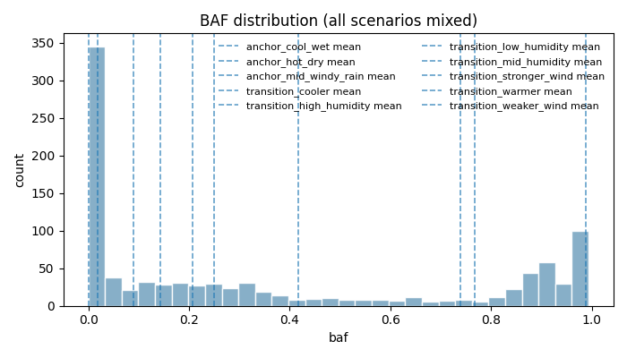
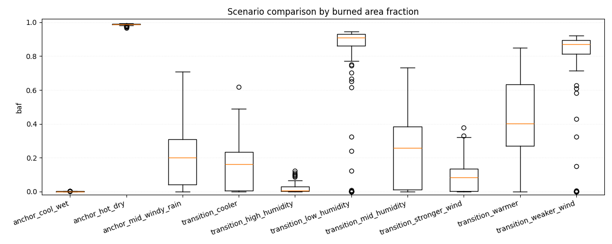
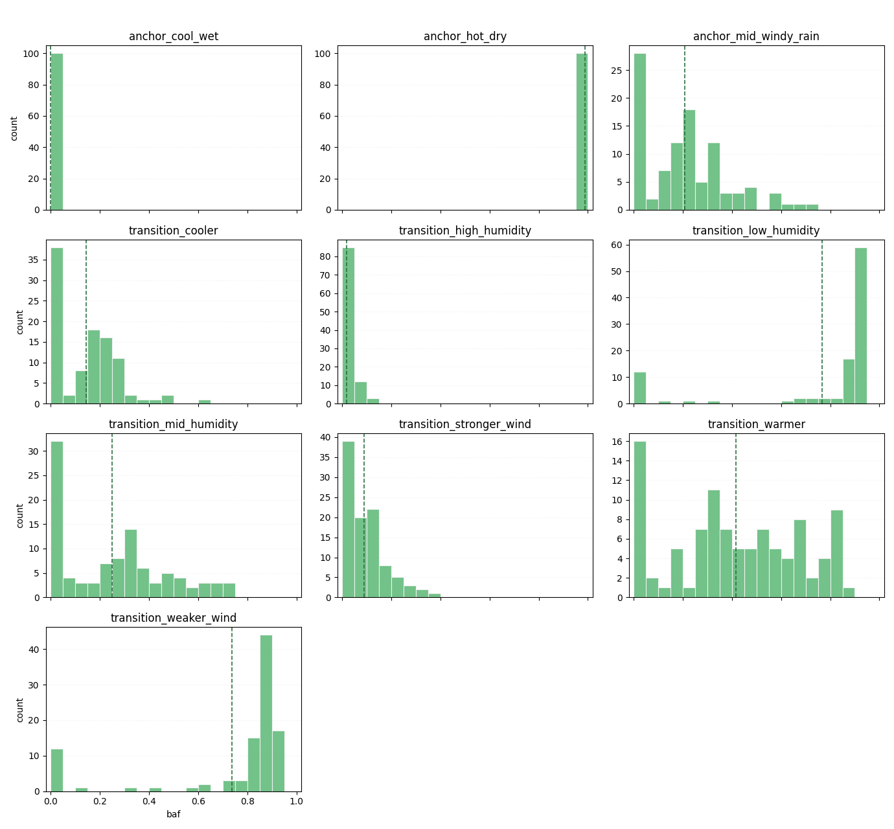
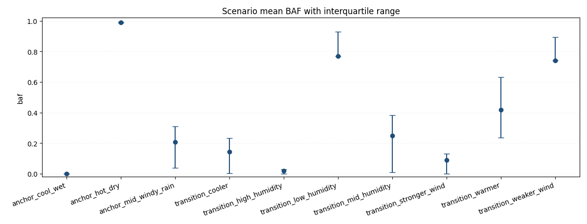

# Forest fire experiments report

## Overall
- Total runs: 1000
- Mean burned area fraction (all / uncensored): 0.3620 / 0.3604
- Mean auc_normalized (all / uncensored): 0.0054 / 0.0055
- Mean time_to_extinguish (all / uncensored): 176.8290 / 167.1771
- Critical share (all / uncensored): 0.2640 / 0.2667
- BAF quantiles p25/p50/p75/p95: 0.0015 / 0.2012 / 0.8325 / 0.9891
- Burned area p95/p99: 0.9891 / 0.9917
- Critical BAF threshold used: 0.8000
- Catastrophic probability (baf >= 0.8000): 0.2640
- Scenario ranking metric: auc_normalized_mean
- Censored runs (truncated by max_steps): 29 (0.0290)
- Note: censored runs can bias metrics: fire_duration and AUC are typically underestimated, while BAF-related risk can be understated when fire is still active at truncation.

## Worst scenarios by Mean auc_normalized (normalized)
- anchor_hot_dry: 0.0189
- transition_weaker_wind: 0.0096
- transition_low_humidity: 0.0089

## Absolute KPI ranking
### Mean burned area fraction (absolute, point estimate)
- anchor_hot_dry: 0.9880
- transition_low_humidity: 0.7680
- transition_weaker_wind: 0.7388
### KPI comparison by scenario (all / uncensored)
- anchor_cool_wet: baf=0.0002/0.0002, auc_normalized=0.0001/0.0001, time_to_extinguish=96.8100/96.8100, critical=0.0000/0.0000, censored_share=0.0000, baf_q(p25/p50/p75/p95)=0.0001/0.0001/0.0002/0.0005
- anchor_hot_dry: baf=0.9880/0.9880, auc_normalized=0.0189/0.0189, time_to_extinguish=167.1200/167.1200, critical=1.0000/1.0000, censored_share=0.0000, baf_q(p25/p50/p75/p95)=0.9867/0.9891/0.9909/0.9922
- anchor_mid_windy_rain: baf=0.2080/0.2018, auc_normalized=0.0032/0.0033, time_to_extinguish=192.9600/173.3617, critical=0.0000/0.0000, censored_share=0.0600, baf_q(p25/p50/p75/p95)=0.0382/0.2002/0.3081/0.5616
- transition_cooler: baf=0.1431/0.1416, auc_normalized=0.0022/0.0022, time_to_extinguish=172.7500/166.0714, critical=0.0000/0.0000, censored_share=0.0200, baf_q(p25/p50/p75/p95)=0.0045/0.1580/0.2314/0.3425
- transition_high_humidity: baf=0.0189/0.0189, auc_normalized=0.0006/0.0006, time_to_extinguish=91.6900/91.6900, critical=0.0000/0.0000, censored_share=0.0000, baf_q(p25/p50/p75/p95)=0.0008/0.0046/0.0275/0.0872
- transition_low_humidity: baf=0.7680/0.7692, auc_normalized=0.0089/0.0092, time_to_extinguish=256.3300/240.7766, critical=0.7800/0.7872, censored_share=0.0600, baf_q(p25/p50/p75/p95)=0.8613/0.9108/0.9294/0.9391
- transition_mid_humidity: baf=0.2491/0.2449, auc_normalized=0.0035/0.0035, time_to_extinguish=207.9100/195.7396, critical=0.0000/0.0000, censored_share=0.0400, baf_q(p25/p50/p75/p95)=0.0100/0.2516/0.3819/0.6539
- transition_stronger_wind: baf=0.0889/0.0878, auc_normalized=0.0017/0.0018, time_to_extinguish=144.2900/133.2887, critical=0.0000/0.0000, censored_share=0.0300, baf_q(p25/p50/p75/p95)=0.0013/0.0793/0.1316/0.2714
- transition_warmer: baf=0.4166/0.4176, auc_normalized=0.0057/0.0058, time_to_extinguish=214.1800/205.3402, critical=0.1000/0.1031, censored_share=0.0300, baf_q(p25/p50/p75/p95)=0.2365/0.3958/0.6331/0.8325
- transition_weaker_wind: baf=0.7388/0.7531, auc_normalized=0.0096/0.0099, time_to_extinguish=224.2500/209.7368, critical=0.7600/0.7895, censored_share=0.0500, baf_q(p25/p50/p75/p95)=0.8091/0.8682/0.8939/0.9076
### Mean burned area fraction (95% bootstrap CI)
- anchor_hot_dry: 0.9880 (95% CI: 0.9870..0.9888)
- transition_low_humidity: 0.7680 (95% CI: 0.7022..0.8265)
- transition_weaker_wind: 0.7388 (95% CI: 0.6751..0.7955)
### Conservative risk ranking (mean BAF upper 95% CI bound)
- anchor_hot_dry: upper_ci=0.9888 (mean=0.9880, 95% CI: 0.9870..0.9888)
- transition_low_humidity: upper_ci=0.8265 (mean=0.7680, 95% CI: 0.7022..0.8265)
- transition_weaker_wind: upper_ci=0.7955 (mean=0.7388, 95% CI: 0.6751..0.7955)
### Mean AUC (absolute)
- anchor_hot_dry: 29865.8300
- transition_low_humidity: 21339.3100
- transition_weaker_wind: 20496.1100

## Normalized KPI ranking
### Mean peak_fire_fraction (normalized)
- anchor_hot_dry: 0.0553
- transition_low_humidity: 0.0273
- transition_weaker_wind: 0.0265

## Composite risk ranking
### Mean composite risk score (normalized, 95% bootstrap CI)
- transition_low_humidity: 0.3285 (95% CI: 0.3046..0.3483)
- transition_weaker_wind: 0.3053 (95% CI: 0.2834..0.3248)
- anchor_hot_dry: 0.3033 (95% CI: 0.2956..0.3117)
### Mean auc_normalized (normalized)
- anchor_hot_dry: 0.0189
- transition_weaker_wind: 0.0096
- transition_low_humidity: 0.0089

## Top parameter-metric correlations (uncontrolled)
- Note: these are global correlations without controlling for scenario.
- param_rain_enabled vs peak_fire_size: -0.7526
- param_humidity vs peak_fire_size: -0.7403
- param_rain_intensity vs peak_fire_size: -0.7060
- param_humidity vs max_spread_rate: -0.6983
- param_humidity vs baf: -0.6790

## Top parameter-metric correlations (controlled by scenario)
- Method: within-scenario demeaning (scenario fixed-effects style).

## Scenario-local top parameter-metric correlations
### anchor_cool_wet
- Not enough information for per-scenario correlation estimation (runs: 100, minimum: 5, varying params: 0/12).
- ⚠️ Constant param_* in this scenario (12): param_conifer_ratio, param_f, param_height, param_humidity, param_init_tree_density...
### anchor_hot_dry
- Not enough information for per-scenario correlation estimation (runs: 100, minimum: 5, varying params: 0/12).
- ⚠️ Constant param_* in this scenario (12): param_conifer_ratio, param_f, param_height, param_humidity, param_init_tree_density...
### anchor_mid_windy_rain
- Not enough information for per-scenario correlation estimation (runs: 100, minimum: 5, varying params: 0/12).
- ⚠️ Constant param_* in this scenario (12): param_conifer_ratio, param_f, param_height, param_humidity, param_init_tree_density...
### transition_cooler
- Not enough information for per-scenario correlation estimation (runs: 100, minimum: 5, varying params: 0/12).
- ⚠️ Constant param_* in this scenario (12): param_conifer_ratio, param_f, param_height, param_humidity, param_init_tree_density...
### transition_high_humidity
- Not enough information for per-scenario correlation estimation (runs: 100, minimum: 5, varying params: 0/12).
- ⚠️ Constant param_* in this scenario (12): param_conifer_ratio, param_f, param_height, param_humidity, param_init_tree_density...
### transition_low_humidity
- Not enough information for per-scenario correlation estimation (runs: 100, minimum: 5, varying params: 0/12).
- ⚠️ Constant param_* in this scenario (12): param_conifer_ratio, param_f, param_height, param_humidity, param_init_tree_density...
### transition_mid_humidity
- Not enough information for per-scenario correlation estimation (runs: 100, minimum: 5, varying params: 0/12).
- ⚠️ Constant param_* in this scenario (12): param_conifer_ratio, param_f, param_height, param_humidity, param_init_tree_density...
### transition_stronger_wind
- Not enough information for per-scenario correlation estimation (runs: 100, minimum: 5, varying params: 0/12).
- ⚠️ Constant param_* in this scenario (12): param_conifer_ratio, param_f, param_height, param_humidity, param_init_tree_density...
### transition_warmer
- Not enough information for per-scenario correlation estimation (runs: 100, minimum: 5, varying params: 0/12).
- ⚠️ Constant param_* in this scenario (12): param_conifer_ratio, param_f, param_height, param_humidity, param_init_tree_density...
### transition_weaker_wind
- Not enough information for per-scenario correlation estimation (runs: 100, minimum: 5, varying params: 0/12).
- ⚠️ Constant param_* in this scenario (12): param_conifer_ratio, param_f, param_height, param_humidity, param_init_tree_density...

## Figures
- baf_hist: Global BAF histogram across all scenarios; dashed lines mark per-scenario means.

- scenario_baf_boxplot: Per-scenario BAF boxplots (median, IQR, outliers). Useful for ranking spread and stability.

- scenario_baf_hist_grid: Small-multiple histograms with fixed BAF bins and per-panel y-scale: each panel shows one scenario distribution.

- scenario_baf_mean_iqr: Scenario mean BAF with interquartile range as asymmetric error bars.

