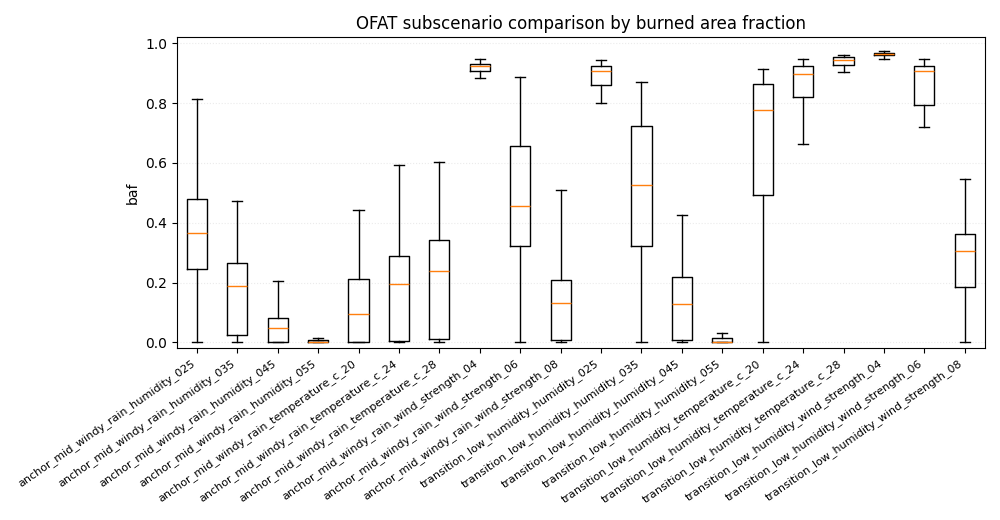
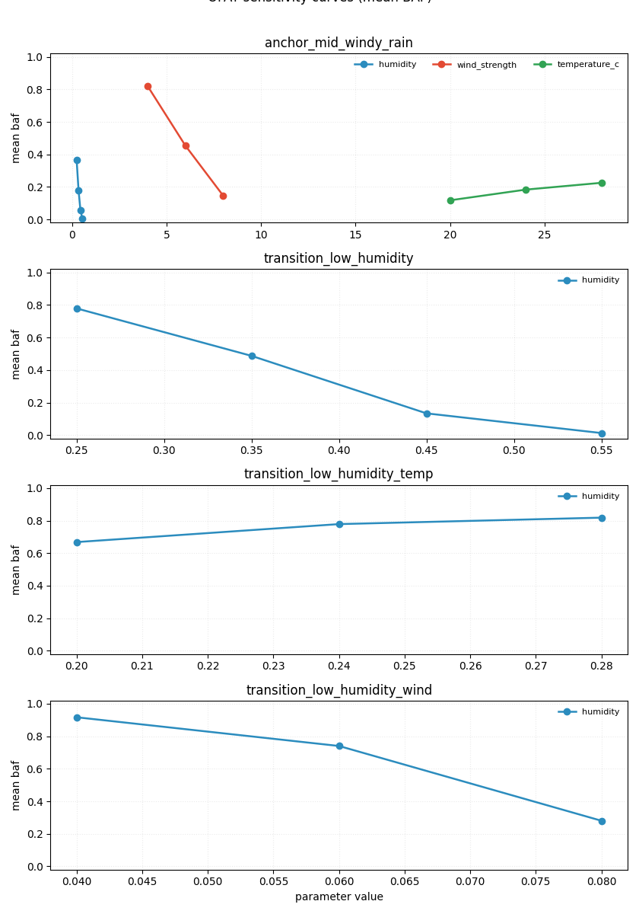

# Forest fire experiments report

## Overall
- Total runs: 3000
- Mean burned area fraction (all / uncensored): 0.3966 / 0.3961
- Mean auc_normalized (all / uncensored): 0.0058 / 0.0059
- Mean time_to_extinguish (all / uncensored): 186.9810 / 176.2989
- Critical share (all / uncensored): 0.2783 / 0.2820
- BAF quantiles p25/p50/p75/p95: 0.0087 / 0.2811 / 0.8606 / 0.9656
- Burned area p95/p99: 0.9656 / 0.9902
- Critical BAF threshold used: 0.8000
- Catastrophic probability (baf >= 0.8000): 0.2783
- Scenario ranking metric: auc_normalized_mean
- Censored runs (truncated by max_steps): 99 (0.0330)
- Note: censored runs can bias metrics: fire_duration and AUC are typically underestimated, while BAF-related risk can be understated when fire is still active at truncation.

## Worst scenarios by Mean auc_normalized (normalized)
- anchor_hot_dry: 0.0189
- transition_low_humidity_wind_strength_04: 0.0165
- anchor_mid_windy_rain_wind_strength_04: 0.0123

## Absolute KPI ranking
### Mean burned area fraction (absolute, point estimate)
- anchor_hot_dry: 0.9880
- transition_low_humidity_wind_strength_04: 0.9168
- anchor_mid_windy_rain_wind_strength_04: 0.8207
### KPI comparison by scenario (all / uncensored)
- anchor_cool_wet: baf=0.0002/0.0002, auc_normalized=0.0001/0.0001, time_to_extinguish=96.8100/96.8100, critical=0.0000/0.0000, censored_share=0.0000, baf_q(p25/p50/p75/p95)=0.0001/0.0001/0.0002/0.0005
- anchor_hot_dry: baf=0.9880/0.9880, auc_normalized=0.0189/0.0189, time_to_extinguish=167.1200/167.1200, critical=1.0000/1.0000, censored_share=0.0000, baf_q(p25/p50/p75/p95)=0.9869/0.9891/0.9909/0.9923
- anchor_mid_windy_rain: baf=0.2080/0.2018, auc_normalized=0.0032/0.0033, time_to_extinguish=192.9600/173.3617, critical=0.0000/0.0000, censored_share=0.0600, baf_q(p25/p50/p75/p95)=0.0398/0.2006/0.3084/0.5625 ⚠️ reliability: time_to_extinguish/AUC may be less reliable; consider larger max_steps.
- anchor_mid_windy_rain_humidity_025: baf=0.3637/0.3576, auc_normalized=0.0058/0.0059, time_to_extinguish=193.1500/183.6598, critical=0.0300/0.0206, censored_share=0.0300, baf_q(p25/p50/p75/p95)=0.2466/0.3646/0.4808/0.7762
- anchor_mid_windy_rain_humidity_035: baf=0.1800/0.1797, auc_normalized=0.0031/0.0032, time_to_extinguish=188.8200/179.1959, critical=0.0000/0.0000, censored_share=0.0300, baf_q(p25/p50/p75/p95)=0.0237/0.1870/0.2660/0.4149
- anchor_mid_windy_rain_humidity_045: baf=0.0566/0.0566, auc_normalized=0.0013/0.0013, time_to_extinguish=119.7800/119.7800, critical=0.0000/0.0000, censored_share=0.0000, baf_q(p25/p50/p75/p95)=0.0011/0.0473/0.0825/0.1877
- anchor_mid_windy_rain_humidity_055: baf=0.0075/0.0075, auc_normalized=0.0004/0.0004, time_to_extinguish=92.5000/92.5000, critical=0.0000/0.0000, censored_share=0.0000, baf_q(p25/p50/p75/p95)=0.0002/0.0021/0.0076/0.0416
- anchor_mid_windy_rain_temperature_c_20: baf=0.1178/0.1182, auc_normalized=0.0020/0.0020, time_to_extinguish=181.8100/175.3163, critical=0.0000/0.0000, censored_share=0.0200, baf_q(p25/p50/p75/p95)=0.0013/0.0948/0.2133/0.3149
- anchor_mid_windy_rain_temperature_c_24: baf=0.1834/0.1843, auc_normalized=0.0031/0.0032, time_to_extinguish=168.2500/154.4271, critical=0.0000/0.0000, censored_share=0.0400, baf_q(p25/p50/p75/p95)=0.0061/0.1955/0.2900/0.4311
- anchor_mid_windy_rain_temperature_c_28: baf=0.2253/0.2231, auc_normalized=0.0040/0.0040, time_to_extinguish=159.7800/152.8367, critical=0.0000/0.0000, censored_share=0.0200, baf_q(p25/p50/p75/p95)=0.0120/0.2381/0.3410/0.5447
- anchor_mid_windy_rain_wind_strength_04: baf=0.8207/0.8282, auc_normalized=0.0123/0.0125, time_to_extinguish=216.9500/211.1735, critical=0.8800/0.8980, censored_share=0.0200, baf_q(p25/p50/p75/p95)=0.9081/0.9233/0.9320/0.9398
- anchor_mid_windy_rain_wind_strength_06: baf=0.4540/0.4622, auc_normalized=0.0064/0.0065, time_to_extinguish=202.5400/196.4694, critical=0.1100/0.1122, censored_share=0.0200, baf_q(p25/p50/p75/p95)=0.3225/0.4552/0.6564/0.8414
- anchor_mid_windy_rain_wind_strength_08: baf=0.1462/0.1461, auc_normalized=0.0024/0.0024, time_to_extinguish=164.7500/157.9082, critical=0.0000/0.0000, censored_share=0.0200, baf_q(p25/p50/p75/p95)=0.0091/0.1333/0.2100/0.4303
- transition_cooler: baf=0.1983/0.1909, auc_normalized=0.0030/0.0030, time_to_extinguish=200.8100/181.7128, critical=0.0000/0.0000, censored_share=0.0600, baf_q(p25/p50/p75/p95)=0.0408/0.1799/0.3216/0.4904 ⚠️ reliability: time_to_extinguish/AUC may be less reliable; consider larger max_steps.
- transition_high_humidity: baf=0.0157/0.0157, auc_normalized=0.0006/0.0006, time_to_extinguish=110.8300/110.8300, critical=0.0000/0.0000, censored_share=0.0000, baf_q(p25/p50/p75/p95)=0.0007/0.0046/0.0162/0.0840
- transition_low_humidity: baf=0.7944/0.8086, auc_normalized=0.0095/0.0101, time_to_extinguish=251.7700/227.2198, critical=0.7900/0.8462, censored_share=0.0900, baf_q(p25/p50/p75/p95)=0.8584/0.9130/0.9283/0.9395 ⚠️ reliability: time_to_extinguish/AUC may be less reliable; consider larger max_steps.
- transition_low_humidity_humidity_025: baf=0.7789/0.7839, auc_normalized=0.0090/0.0093, time_to_extinguish=263.6600/251.2211, critical=0.8200/0.8316, censored_share=0.0500, baf_q(p25/p50/p75/p95)=0.8595/0.9085/0.9257/0.9383
- transition_low_humidity_humidity_035: baf=0.4871/0.4959, auc_normalized=0.0062/0.0064, time_to_extinguish=235.7800/227.6082, critical=0.1200/0.1237, censored_share=0.0300, baf_q(p25/p50/p75/p95)=0.3227/0.5275/0.7245/0.8292
- transition_low_humidity_humidity_045: baf=0.1336/0.1338, auc_normalized=0.0024/0.0025, time_to_extinguish=150.0900/142.9490, critical=0.0000/0.0000, censored_share=0.0200, baf_q(p25/p50/p75/p95)=0.0076/0.1300/0.2195/0.3361
- transition_low_humidity_humidity_055: baf=0.0126/0.0126, auc_normalized=0.0005/0.0005, time_to_extinguish=81.4900/81.4900, critical=0.0000/0.0000, censored_share=0.0000, baf_q(p25/p50/p75/p95)=0.0006/0.0030/0.0148/0.0574
- transition_low_humidity_temperature_c_20: baf=0.6681/0.6774, auc_normalized=0.0081/0.0084, time_to_extinguish=248.7500/238.2812, critical=0.4800/0.5000, censored_share=0.0400, baf_q(p25/p50/p75/p95)=0.4934/0.7762/0.8656/0.9044
- transition_low_humidity_temperature_c_24: baf=0.7786/0.7985, auc_normalized=0.0097/0.0102, time_to_extinguish=250.7700/234.8617, critical=0.7700/0.7979, censored_share=0.0600, baf_q(p25/p50/p75/p95)=0.8196/0.8988/0.9247/0.9353 ⚠️ reliability: time_to_extinguish/AUC may be less reliable; consider larger max_steps.
- transition_low_humidity_temperature_c_28: baf=0.8183/0.8423, auc_normalized=0.0113/0.0119, time_to_extinguish=230.7600/213.5745, critical=0.8600/0.8936, censored_share=0.0600, baf_q(p25/p50/p75/p95)=0.9272/0.9431/0.9531/0.9585 ⚠️ reliability: time_to_extinguish/AUC may be less reliable; consider larger max_steps.
- transition_low_humidity_wind_strength_04: baf=0.9168/0.9348, auc_normalized=0.0165/0.0171, time_to_extinguish=189.7100/176.7812, critical=0.9400/0.9688, censored_share=0.0400, baf_q(p25/p50/p75/p95)=0.9602/0.9656/0.9687/0.9719
- transition_low_humidity_wind_strength_06: baf=0.7402/0.7642, auc_normalized=0.0084/0.0090, time_to_extinguish=264.8500/238.7222, critical=0.7400/0.7889, censored_share=0.1000, baf_q(p25/p50/p75/p95)=0.7926/0.9066/0.9251/0.9402 ⚠️ reliability: time_to_extinguish/AUC may be less reliable; consider larger max_steps.
- transition_low_humidity_wind_strength_08: baf=0.2806/0.2842, auc_normalized=0.0051/0.0053, time_to_extinguish=182.6800/172.8660, critical=0.0000/0.0000, censored_share=0.0300, baf_q(p25/p50/p75/p95)=0.1859/0.3051/0.3620/0.5470
- transition_mid_humidity: baf=0.2748/0.2740, auc_normalized=0.0041/0.0042, time_to_extinguish=185.5700/172.4688, critical=0.0000/0.0000, censored_share=0.0400, baf_q(p25/p50/p75/p95)=0.0521/0.2631/0.3871/0.6805
- transition_stronger_wind: baf=0.0804/0.0776, auc_normalized=0.0015/0.0015, time_to_extinguish=147.1700/139.9694, critical=0.0000/0.0000, censored_share=0.0200, baf_q(p25/p50/p75/p95)=0.0007/0.0538/0.1273/0.2281
- transition_warmer: baf=0.4162/0.4145, auc_normalized=0.0057/0.0058, time_to_extinguish=229.5600/224.0408, critical=0.0300/0.0306, censored_share=0.0200, baf_q(p25/p50/p75/p95)=0.2534/0.4427/0.5787/0.7963
- transition_weaker_wind: baf=0.7536/0.7634, auc_normalized=0.0095/0.0099, time_to_extinguish=239.9600/220.3871, critical=0.7800/0.8065, censored_share=0.0700, baf_q(p25/p50/p75/p95)=0.8231/0.8776/0.8963/0.9043 ⚠️ reliability: time_to_extinguish/AUC may be less reliable; consider larger max_steps.
### Censoring reliability flags
- Scenarios with censored_share >= 0.06 should be interpreted with care for time_to_extinguish/AUC.
- transition_low_humidity_wind_strength_06: censored_share=0.1000
- transition_low_humidity: censored_share=0.0900
- transition_weaker_wind: censored_share=0.0700
- anchor_mid_windy_rain: censored_share=0.0600
- transition_low_humidity_temperature_c_24: censored_share=0.0600
- transition_low_humidity_temperature_c_28: censored_share=0.0600
- transition_cooler: censored_share=0.0600
### Mean burned area fraction (95% bootstrap CI)
- anchor_hot_dry: 0.9880 (95% CI: 0.9870..0.9888)
- transition_low_humidity_wind_strength_04: 0.9168 (95% CI: 0.8746..0.9503)
- anchor_mid_windy_rain_wind_strength_04: 0.8207 (95% CI: 0.7613..0.8721)
### Conservative risk ranking (mean BAF upper 95% CI bound)
- anchor_hot_dry: upper_ci=0.9888 (mean=0.9880, 95% CI: 0.9870..0.9888)
- transition_low_humidity_wind_strength_04: upper_ci=0.9503 (mean=0.9168, 95% CI: 0.8746..0.9503)
- transition_low_humidity_temperature_c_28: upper_ci=0.8755 (mean=0.8183, 95% CI: 0.7529..0.8755)
### Mean AUC (absolute)
- anchor_hot_dry: 29865.8300
- transition_low_humidity_wind_strength_04: 25437.8500
- anchor_mid_windy_rain_wind_strength_04: 22786.9700

## Normalized KPI ranking
### Mean peak_fire_fraction (normalized)
- anchor_hot_dry: 0.0553
- transition_low_humidity_wind_strength_04: 0.0439
- anchor_mid_windy_rain_wind_strength_04: 0.0324

## Composite risk ranking
### Mean composite risk score (normalized, 95% bootstrap CI)
- anchor_hot_dry: 0.3484 (95% CI: 0.3438..0.3534)
- transition_low_humidity_wind_strength_04: 0.3385 (95% CI: 0.3283..0.3483)
- transition_low_humidity_humidity_025: 0.3351 (95% CI: 0.3148..0.3538)
### Mean auc_normalized (normalized)
- anchor_hot_dry: 0.0189
- transition_low_humidity_wind_strength_04: 0.0165
- anchor_mid_windy_rain_wind_strength_04: 0.0123

## Top parameter-metric correlations (uncontrolled)
- Note: these are global correlations without controlling for scenario.
- param_humidity vs peak_fire_size: r=-0.6499, 95% CI -0.6677..-0.6308
- param_humidity vs max_spread_rate: r=-0.6247, 95% CI -0.6435..-0.6046
- param_humidity vs baf: r=-0.6193, 95% CI -0.6375..-0.5997
- param_humidity vs fire_duration: r=-0.4747, 95% CI -0.4982..-0.4497
- param_rain_enabled vs peak_fire_size: r=-0.4605, 95% CI -0.4977..-0.4230

## Top parameter-metric correlations (controlled by scenario)
- Method: within-scenario demeaning (scenario fixed-effects style).

## Scenario-local top parameter-metric correlations
### anchor_cool_wet
- Not enough information for per-scenario correlation estimation (runs: 100, minimum: 5, varying params: 0/12).
- ⚠️ Constant param_* in this scenario (12): param_conifer_ratio, param_f, param_height, param_humidity, param_init_tree_density...
### anchor_hot_dry
- Not enough information for per-scenario correlation estimation (runs: 100, minimum: 5, varying params: 0/12).
- ⚠️ Constant param_* in this scenario (12): param_conifer_ratio, param_f, param_height, param_humidity, param_init_tree_density...
### anchor_mid_windy_rain
- Not enough information for per-scenario correlation estimation (runs: 100, minimum: 5, varying params: 0/12).
- ⚠️ Constant param_* in this scenario (12): param_conifer_ratio, param_f, param_height, param_humidity, param_init_tree_density...
### anchor_mid_windy_rain_humidity_025
- Not enough information for per-scenario correlation estimation (runs: 100, minimum: 5, varying params: 0/12).
- ⚠️ Constant param_* in this scenario (12): param_conifer_ratio, param_f, param_height, param_humidity, param_init_tree_density...
### anchor_mid_windy_rain_humidity_035
- Not enough information for per-scenario correlation estimation (runs: 100, minimum: 5, varying params: 0/12).
- ⚠️ Constant param_* in this scenario (12): param_conifer_ratio, param_f, param_height, param_humidity, param_init_tree_density...
### anchor_mid_windy_rain_humidity_045
- Not enough information for per-scenario correlation estimation (runs: 100, minimum: 5, varying params: 0/12).
- ⚠️ Constant param_* in this scenario (12): param_conifer_ratio, param_f, param_height, param_humidity, param_init_tree_density...
### anchor_mid_windy_rain_humidity_055
- Not enough information for per-scenario correlation estimation (runs: 100, minimum: 5, varying params: 0/12).
- ⚠️ Constant param_* in this scenario (12): param_conifer_ratio, param_f, param_height, param_humidity, param_init_tree_density...
### anchor_mid_windy_rain_temperature_c_20
- Not enough information for per-scenario correlation estimation (runs: 100, minimum: 5, varying params: 0/12).
- ⚠️ Constant param_* in this scenario (12): param_conifer_ratio, param_f, param_height, param_humidity, param_init_tree_density...
### anchor_mid_windy_rain_temperature_c_24
- Not enough information for per-scenario correlation estimation (runs: 100, minimum: 5, varying params: 0/12).
- ⚠️ Constant param_* in this scenario (12): param_conifer_ratio, param_f, param_height, param_humidity, param_init_tree_density...
### anchor_mid_windy_rain_temperature_c_28
- Not enough information for per-scenario correlation estimation (runs: 100, minimum: 5, varying params: 0/12).
- ⚠️ Constant param_* in this scenario (12): param_conifer_ratio, param_f, param_height, param_humidity, param_init_tree_density...
### anchor_mid_windy_rain_wind_strength_04
- Not enough information for per-scenario correlation estimation (runs: 100, minimum: 5, varying params: 0/12).
- ⚠️ Constant param_* in this scenario (12): param_conifer_ratio, param_f, param_height, param_humidity, param_init_tree_density...
### anchor_mid_windy_rain_wind_strength_06
- Not enough information for per-scenario correlation estimation (runs: 100, minimum: 5, varying params: 0/12).
- ⚠️ Constant param_* in this scenario (12): param_conifer_ratio, param_f, param_height, param_humidity, param_init_tree_density...
### anchor_mid_windy_rain_wind_strength_08
- Not enough information for per-scenario correlation estimation (runs: 100, minimum: 5, varying params: 0/12).
- ⚠️ Constant param_* in this scenario (12): param_conifer_ratio, param_f, param_height, param_humidity, param_init_tree_density...
### transition_cooler
- Not enough information for per-scenario correlation estimation (runs: 100, minimum: 5, varying params: 0/12).
- ⚠️ Constant param_* in this scenario (12): param_conifer_ratio, param_f, param_height, param_humidity, param_init_tree_density...
### transition_high_humidity
- Not enough information for per-scenario correlation estimation (runs: 100, minimum: 5, varying params: 0/12).
- ⚠️ Constant param_* in this scenario (12): param_conifer_ratio, param_f, param_height, param_humidity, param_init_tree_density...
### transition_low_humidity
- Not enough information for per-scenario correlation estimation (runs: 100, minimum: 5, varying params: 0/12).
- ⚠️ Constant param_* in this scenario (12): param_conifer_ratio, param_f, param_height, param_humidity, param_init_tree_density...
### transition_low_humidity_humidity_025
- Not enough information for per-scenario correlation estimation (runs: 100, minimum: 5, varying params: 0/12).
- ⚠️ Constant param_* in this scenario (12): param_conifer_ratio, param_f, param_height, param_humidity, param_init_tree_density...
### transition_low_humidity_humidity_035
- Not enough information for per-scenario correlation estimation (runs: 100, minimum: 5, varying params: 0/12).
- ⚠️ Constant param_* in this scenario (12): param_conifer_ratio, param_f, param_height, param_humidity, param_init_tree_density...
### transition_low_humidity_humidity_045
- Not enough information for per-scenario correlation estimation (runs: 100, minimum: 5, varying params: 0/12).
- ⚠️ Constant param_* in this scenario (12): param_conifer_ratio, param_f, param_height, param_humidity, param_init_tree_density...
### transition_low_humidity_humidity_055
- Not enough information for per-scenario correlation estimation (runs: 100, minimum: 5, varying params: 0/12).
- ⚠️ Constant param_* in this scenario (12): param_conifer_ratio, param_f, param_height, param_humidity, param_init_tree_density...
### transition_low_humidity_temperature_c_20
- Not enough information for per-scenario correlation estimation (runs: 100, minimum: 5, varying params: 0/12).
- ⚠️ Constant param_* in this scenario (12): param_conifer_ratio, param_f, param_height, param_humidity, param_init_tree_density...
### transition_low_humidity_temperature_c_24
- Not enough information for per-scenario correlation estimation (runs: 100, minimum: 5, varying params: 0/12).
- ⚠️ Constant param_* in this scenario (12): param_conifer_ratio, param_f, param_height, param_humidity, param_init_tree_density...
### transition_low_humidity_temperature_c_28
- Not enough information for per-scenario correlation estimation (runs: 100, minimum: 5, varying params: 0/12).
- ⚠️ Constant param_* in this scenario (12): param_conifer_ratio, param_f, param_height, param_humidity, param_init_tree_density...
### transition_low_humidity_wind_strength_04
- Not enough information for per-scenario correlation estimation (runs: 100, minimum: 5, varying params: 0/12).
- ⚠️ Constant param_* in this scenario (12): param_conifer_ratio, param_f, param_height, param_humidity, param_init_tree_density...
### transition_low_humidity_wind_strength_06
- Not enough information for per-scenario correlation estimation (runs: 100, minimum: 5, varying params: 0/12).
- ⚠️ Constant param_* in this scenario (12): param_conifer_ratio, param_f, param_height, param_humidity, param_init_tree_density...
### transition_low_humidity_wind_strength_08
- Not enough information for per-scenario correlation estimation (runs: 100, minimum: 5, varying params: 0/12).
- ⚠️ Constant param_* in this scenario (12): param_conifer_ratio, param_f, param_height, param_humidity, param_init_tree_density...
### transition_mid_humidity
- Not enough information for per-scenario correlation estimation (runs: 100, minimum: 5, varying params: 0/12).
- ⚠️ Constant param_* in this scenario (12): param_conifer_ratio, param_f, param_height, param_humidity, param_init_tree_density...
### transition_stronger_wind
- Not enough information for per-scenario correlation estimation (runs: 100, minimum: 5, varying params: 0/12).
- ⚠️ Constant param_* in this scenario (12): param_conifer_ratio, param_f, param_height, param_humidity, param_init_tree_density...
### transition_warmer
- Not enough information for per-scenario correlation estimation (runs: 100, minimum: 5, varying params: 0/12).
- ⚠️ Constant param_* in this scenario (12): param_conifer_ratio, param_f, param_height, param_humidity, param_init_tree_density...
### transition_weaker_wind
- Not enough information for per-scenario correlation estimation (runs: 100, minimum: 5, varying params: 0/12).
- ⚠️ Constant param_* in this scenario (12): param_conifer_ratio, param_f, param_height, param_humidity, param_init_tree_density...

## Family-level parameter sensitivity (OFAT-aware)
- Grouping rule: OFAT scenarios are grouped by base family (e.g. `<base>_humidity_*` -> `<base>`), other scenarios remain as-is.
- For each family: Pearson correlation and linear slope with 95% bootstrap CI.
### anchor_cool_wet
- Not enough information for family-level sensitivity estimation (runs: 100, minimum: 5, varying params: 0/12).
### anchor_hot_dry
- Not enough information for family-level sensitivity estimation (runs: 100, minimum: 5, varying params: 0/12).
### anchor_mid_windy_rain
- param_wind_strength vs baf: r=-0.7047 (95% CI -0.7518..-0.6501), slope=-1.8205 (95% CI -1.9528..-1.6720)
- param_wind_strength vs auc_normalized: r=-0.6626 (95% CI -0.7129..-0.6052), slope=-0.0258 (95% CI -0.0285..-0.0230)
- param_humidity vs baf: r=-0.3606 (95% CI -0.3927..-0.3258), slope=-1.4097 (95% CI -1.5222..-1.2978)
- param_humidity vs auc_normalized: r=-0.3553 (95% CI -0.3903..-0.3194), slope=-0.0209 (95% CI -0.0227..-0.0192)
- param_humidity vs time_to_extinguish: r=-0.2173 (95% CI -0.2720..-0.1564), slope=-408.8145 (95% CI -508.1924..-296.5281)
### transition_cooler
- Not enough information for family-level sensitivity estimation (runs: 100, minimum: 5, varying params: 0/12).
### transition_high_humidity
- Not enough information for family-level sensitivity estimation (runs: 100, minimum: 5, varying params: 0/12).
### transition_low_humidity
- param_humidity vs baf: r=-0.8108 (95% CI -0.8495..-0.7692), slope=-2.7291 (95% CI -2.8656..-2.5748)
- param_humidity vs auc_normalized: r=-0.7262 (95% CI -0.7683..-0.6817), slope=-0.0302 (95% CI -0.0324..-0.0278)
- param_humidity vs time_to_extinguish: r=-0.4887 (95% CI -0.5570..-0.4103), slope=-586.6441 (95% CI -675.7482..-491.3103)
### transition_low_humidity_temp
- param_temperature_c vs auc_normalized: r=0.2815 (95% CI 0.1583..0.3875), slope=0.0004 (95% CI 0.0002..0.0005)
- param_temperature_c vs baf: r=0.2122 (95% CI 0.0859..0.3275), slope=0.0188 (95% CI 0.0081..0.0281)
- param_temperature_c vs time_to_extinguish: r=-0.0647 (95% CI -0.1801..0.0454), slope=-2.2488 (95% CI -6.1738..1.6166)
### transition_low_humidity_wind
- param_wind_strength vs baf: r=-0.7174 (95% CI -0.7796..-0.6496), slope=-1.5904 (95% CI -1.7173..-1.4545)
- param_wind_strength vs auc_normalized: r=-0.6859 (95% CI -0.7502..-0.6174), slope=-0.0285 (95% CI -0.0320..-0.0250)
- param_wind_strength vs time_to_extinguish: r=-0.0221 (95% CI -0.1292..0.0907), slope=-17.5750 (95% CI -102.0894..71.1731)
### transition_mid_humidity
- Not enough information for family-level sensitivity estimation (runs: 100, minimum: 5, varying params: 0/12).
### transition_stronger_wind
- Not enough information for family-level sensitivity estimation (runs: 100, minimum: 5, varying params: 0/12).
### transition_warmer
- Not enough information for family-level sensitivity estimation (runs: 100, minimum: 5, varying params: 0/12).
### transition_weaker_wind
- Not enough information for family-level sensitivity estimation (runs: 100, minimum: 5, varying params: 0/12).

## Figures
- baf_hist: Global BAF histogram across all scenarios; dashed lines mark per-scenario means.

- scenario_baf_boxplot: Per-scenario BAF boxplots for core scenarios only (median, IQR, outliers). OFAT variants are shown separately.

- scenario_baf_boxplot_ofat: Separate BAF boxplots for OFAT subscenarios to avoid overcrowding.

- scenario_baf_hist_grid: Small-multiple histograms with fixed BAF bins and per-panel y-scale: each panel shows one scenario distribution.

- scenario_baf_mean_iqr: Scenario mean BAF with interquartile range as asymmetric error bars.

- scenario_baf_mean_ofat_curves: OFAT sensitivity curves: mean BAF vs varied parameter value by base scenario.

