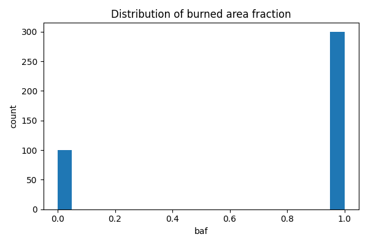
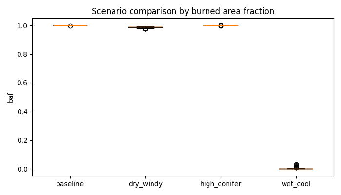

# Forest fire experiments report

## Overall
- Total runs: 400
- Mean burned area fraction: 0.7473
- Burned area p95/p99: 0.9998 / 1.0000
- Catastrophic probability (baf >= 0.8): 0.7500
- Scenario ranking metric: auc_normalized_mean

## Worst scenarios by normalized AUC (mean)
- baseline: 0.0343
- high_conifer: 0.0321
- dry_windy: 0.0190

## Absolute KPI ranking
### Mean burned area fraction (absolute, point estimate)
- high_conifer: 0.9995
- baseline: 0.9994
- dry_windy: 0.9875
### Mean burned area fraction (95% bootstrap CI)
- high_conifer: 0.9995 (95% CI: 0.9994..0.9996)
- baseline: 0.9994 (95% CI: 0.9994..0.9995)
- dry_windy: 0.9875 (95% CI: 0.9867..0.9882)
### Conservative risk ranking (mean BAF upper 95% CI bound)
- high_conifer: upper_ci=0.9996 (mean=0.9995, 95% CI: 0.9994..0.9996)
- baseline: upper_ci=0.9995 (mean=0.9994, 95% CI: 0.9994..0.9995)
- dry_windy: upper_ci=0.9882 (mean=0.9875, 95% CI: 0.9867..0.9882)
### Mean AUC (absolute)
- high_conifer: 30252.3500
- baseline: 30212.9000
- dry_windy: 29853.2600

## Normalized KPI ranking
### Mean peak_fire_fraction (normalized)
- baseline: 0.0769
- high_conifer: 0.0733
- dry_windy: 0.0534
### Mean auc_normalized (normalized)
- baseline: 0.0343
- high_conifer: 0.0321
- dry_windy: 0.0190

## Top parameter-metric correlations
- param_temperature_c vs baf: 0.9999
- param_rain_enabled vs baf: -0.9999
- param_rain_intensity vs baf: -0.9999
- param_humidity vs baf: -0.9389
- param_humidity vs fire_duration: -0.9151

## Figures

