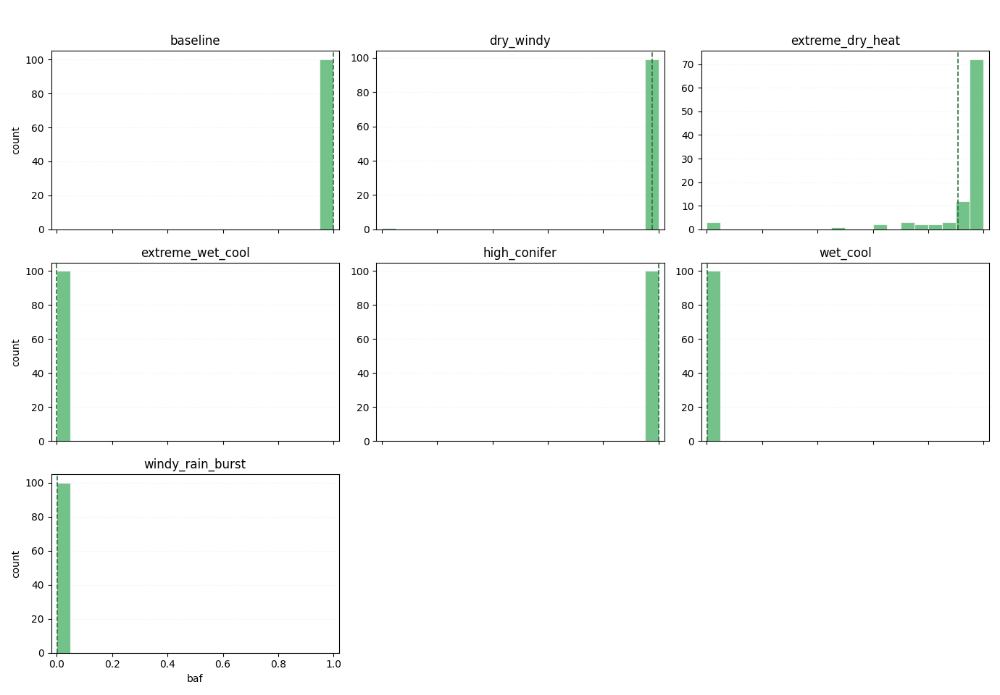
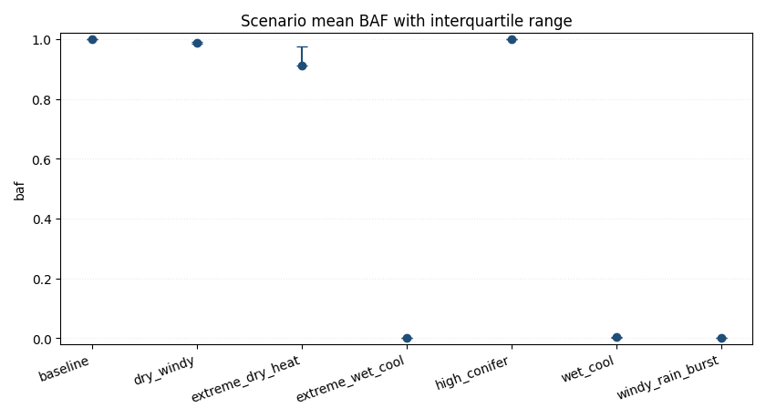

# Forest fire experiments report

## Overall
- Total runs: 700
- Mean burned area fraction (all / uncensored): 0.5572 / 0.5531
- Mean auc_normalized (all / uncensored): 0.0140 / 0.0142
- Mean time_to_extinguish (all / uncensored): 145.3357 / 140.7164
- Critical share (all / uncensored): 0.5557 / 0.5543
- BAF quantiles p25/p50/p75/p95: 0.0003 / 0.9646 / 0.9990 / 0.9998
- Burned area p95/p99: 0.9998 / 0.9999
- Critical BAF threshold used: 0.8000
- Catastrophic probability (baf >= 0.8000): 0.5557
- Scenario ranking metric: auc_normalized_mean
- Censored runs (truncated by max_steps): 9 (0.0129)
- Note: censored runs can bias metrics: fire_duration and AUC are typically underestimated, while BAF-related risk can be understated when fire is still active at truncation.

## Worst scenarios by Mean auc_normalized (normalized)
- baseline: 0.0343
- high_conifer: 0.0321
- dry_windy: 0.0190

## Absolute KPI ranking
### Mean burned area fraction (absolute, point estimate)
- high_conifer: 0.9995
- baseline: 0.9994
- dry_windy: 0.9875
### KPI comparison by scenario (all / uncensored)
- baseline: baf=0.9994/0.9994, auc_normalized=0.0343/0.0343, time_to_extinguish=103.4300/103.4300, critical=1.0000/1.0000, censored_share=0.0000, baf_q(p25/p50/p75/p95)=0.9992/0.9995/0.9997/0.9999
- dry_windy: baf=0.9875/0.9876, auc_normalized=0.0190/0.0193, time_to_extinguish=169.9100/163.1735, critical=1.0000/1.0000, censored_share=0.0200, baf_q(p25/p50/p75/p95)=0.9860/0.9885/0.9901/0.9922
- extreme_dry_heat: baf=0.9105/0.9157, auc_normalized=0.0124/0.0130, time_to_extinguish=248.1600/229.2043, critical=0.8900/0.9140, censored_share=0.0700, baf_q(p25/p50/p75/p95)=0.9335/0.9646/0.9758/0.9825
- extreme_wet_cool: baf=0.0001/0.0001, auc_normalized=0.0000/0.0000, time_to_extinguish=124.8000/124.8000, critical=0.0000/0.0000, censored_share=0.0000, baf_q(p25/p50/p75/p95)=0.0001/0.0001/0.0001/0.0002
- high_conifer: baf=0.9995/0.9995, auc_normalized=0.0321/0.0321, time_to_extinguish=120.0000/120.0000, critical=1.0000/1.0000, censored_share=0.0000, baf_q(p25/p50/p75/p95)=0.9994/0.9995/0.9997/0.9999
- wet_cool: baf=0.0027/0.0027, auc_normalized=0.0002/0.0002, time_to_extinguish=119.8300/119.8300, critical=0.0000/0.0000, censored_share=0.0000, baf_q(p25/p50/p75/p95)=0.0001/0.0013/0.0027/0.0106
- windy_rain_burst: baf=0.0007/0.0007, auc_normalized=0.0001/0.0001, time_to_extinguish=131.2200/131.2200, critical=0.0000/0.0000, censored_share=0.0000, baf_q(p25/p50/p75/p95)=0.0001/0.0003/0.0008/0.0023
### Mean burned area fraction (95% bootstrap CI)
- high_conifer: 0.9995 (95% CI: 0.9994..0.9996)
- baseline: 0.9994 (95% CI: 0.9994..0.9995)
- dry_windy: 0.9875 (95% CI: 0.9867..0.9882)
### Conservative risk ranking (mean BAF upper 95% CI bound)
- high_conifer: upper_ci=0.9996 (mean=0.9995, 95% CI: 0.9994..0.9996)
- baseline: upper_ci=0.9995 (mean=0.9994, 95% CI: 0.9994..0.9995)
- dry_windy: upper_ci=0.9882 (mean=0.9875, 95% CI: 0.9867..0.9882)
### Mean AUC (absolute)
- high_conifer: 30252.3500
- baseline: 30212.9000
- dry_windy: 29853.2600

## Normalized KPI ranking
### Mean peak_fire_fraction (normalized)
- baseline: 0.0769
- high_conifer: 0.0733
- dry_windy: 0.0534

## Composite risk ranking
### Mean composite risk score (normalized, 95% bootstrap CI)
- extreme_dry_heat: 0.3648 (95% CI: 0.3518..0.3769)
- dry_windy: 0.3493 (95% CI: 0.3435..0.3563)
- high_conifer: 0.3355 (95% CI: 0.3289..0.3430)
### Mean auc_normalized (normalized)
- baseline: 0.0343
- high_conifer: 0.0321
- dry_windy: 0.0190

## Top parameter-metric correlations (uncontrolled)
- Note: these are global correlations without controlling for scenario.
- param_rain_enabled vs baf: r=-0.9916, 95% CI -0.9972..-0.9833
- param_rain_intensity vs baf: r=-0.9450, 95% CI -0.9519..-0.9364
- param_rain_enabled vs max_spread_rate: r=-0.9309, 95% CI -0.9410..-0.9199
- param_rain_enabled vs peak_fire_size: r=-0.8937, 95% CI -0.9070..-0.8797
- param_rain_intensity vs max_spread_rate: r=-0.8936, 95% CI -0.9028..-0.8838

## Top parameter-metric correlations (controlled by scenario)
- Method: within-scenario demeaning (scenario fixed-effects style).

## Scenario-local top parameter-metric correlations
### baseline
- Not enough information for per-scenario correlation estimation (runs: 100, minimum: 5, varying params: 0/14).
- ⚠️ Constant param_* in this scenario (14): param_conifer_ratio, param_f, param_flamm_conif, param_flamm_decid, param_height...
### dry_windy
- Not enough information for per-scenario correlation estimation (runs: 100, minimum: 5, varying params: 0/14).
- ⚠️ Constant param_* in this scenario (14): param_conifer_ratio, param_f, param_flamm_conif, param_flamm_decid, param_height...
### extreme_dry_heat
- Not enough information for per-scenario correlation estimation (runs: 100, minimum: 5, varying params: 0/14).
- ⚠️ Constant param_* in this scenario (14): param_conifer_ratio, param_f, param_flamm_conif, param_flamm_decid, param_height...
### extreme_wet_cool
- Not enough information for per-scenario correlation estimation (runs: 100, minimum: 5, varying params: 0/14).
- ⚠️ Constant param_* in this scenario (14): param_conifer_ratio, param_f, param_flamm_conif, param_flamm_decid, param_height...
### high_conifer
- Not enough information for per-scenario correlation estimation (runs: 100, minimum: 5, varying params: 0/14).
- ⚠️ Constant param_* in this scenario (14): param_conifer_ratio, param_f, param_flamm_conif, param_flamm_decid, param_height...
### wet_cool
- Not enough information for per-scenario correlation estimation (runs: 100, minimum: 5, varying params: 0/14).
- ⚠️ Constant param_* in this scenario (14): param_conifer_ratio, param_f, param_flamm_conif, param_flamm_decid, param_height...
### windy_rain_burst
- Not enough information for per-scenario correlation estimation (runs: 100, minimum: 5, varying params: 0/14).
- ⚠️ Constant param_* in this scenario (14): param_conifer_ratio, param_f, param_flamm_conif, param_flamm_decid, param_height...

## Figures
- baf_hist: Global BAF histogram across all scenarios; dashed lines mark per-scenario means.

- scenario_baf_boxplot: Per-scenario BAF boxplots for core scenarios only (median, IQR, outliers). OFAT variants are shown separately.

- scenario_baf_hist_grid: Small-multiple histograms with fixed BAF bins and per-panel y-scale: each panel shows one scenario distribution.

- scenario_baf_mean_iqr: Scenario mean BAF with interquartile range as asymmetric error bars.

