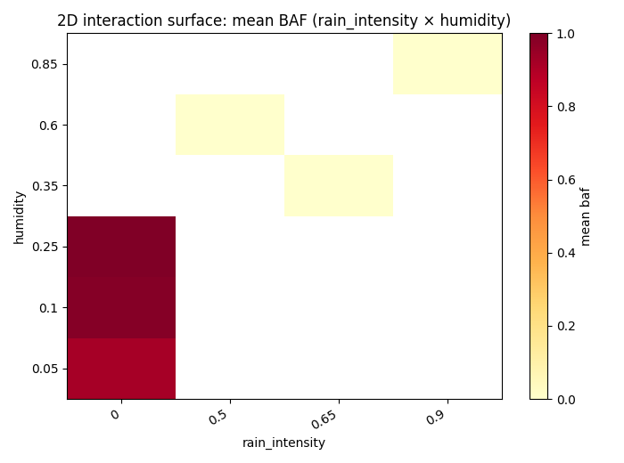
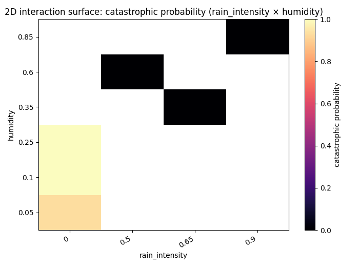

# Forest fire experiments report

## Overall
- Total runs: 700
- Mean burned area fraction (all / uncensored): 0.5586 / 0.5586
- Mean auc_normalized (all / uncensored): 0.0139 / 0.0139
- Mean time_to_extinguish (all / uncensored): 146.1400 / 146.1400
- Critical share (all / uncensored): 0.5614 / 0.5614
- BAF quantiles p25/p50/p75/p95: 0.0003 / 0.9639 / 0.9990 / 0.9998
- Burned area p95/p99: 0.9998 / 0.9999
- Critical BAF threshold used: 0.8000
- Catastrophic probability (baf >= 0.8000): 0.5614
- Scenario ranking metric: auc_normalized_mean
- Censored runs (truncated by max_steps): 0 (0.0000)
- Pairwise significance tests: 20 / 21 significant pairs for baf; 20 / 21 for auc_normalized (BH q<=0.05).
- Note: censored runs can bias metrics: fire_duration and AUC are typically underestimated, while BAF-related risk can be understated when fire is still active at truncation.

## Worst scenarios by Mean auc_normalized (normalized)
- baseline: 0.0343
- high_conifer: 0.0321
- dry_windy: 0.0186

## Censoring max_steps bias audit
- Target rule: censored_share < 0.0200
- Initial max_steps: 500
- Final max_steps: 800
- Stop reason: target_met
### Round 1: max_steps 500 -> 800
- Re-run scenarios: dry_windy, extreme_dry_heat
- dry_windy: censored_share 0.0200 -> 0.0000; baf_mean_all 0.9875 -> 0.9882; auc_normalized_mean_all 0.0190 -> 0.0186
- extreme_dry_heat: censored_share 0.0700 -> 0.0000; baf_mean_all 0.9105 -> 0.9197; auc_normalized_mean_all 0.0124 -> 0.0121

## Absolute KPI ranking
### Mean burned area fraction (absolute, point estimate)
- high_conifer: 0.9995
- baseline: 0.9994
- dry_windy: 0.9882
### KPI comparison by scenario (all / uncensored)
- baseline: baf=0.9994/0.9994, auc_normalized=0.0343/0.0343, time_to_extinguish=103.4300/103.4300, critical=1.0000/1.0000, censored_share=0.0000, baf_q(p25/p50/p75/p95)=0.9992/0.9995/0.9997/0.9999
- dry_windy: baf=0.9882/0.9882, auc_normalized=0.0186/0.0186, time_to_extinguish=179.5500/179.5500, critical=1.0000/1.0000, censored_share=0.0000, baf_q(p25/p50/p75/p95)=0.9871/0.9891/0.9906/0.9921
- extreme_dry_heat: baf=0.9197/0.9197, auc_normalized=0.0121/0.0121, time_to_extinguish=244.1500/244.1500, critical=0.9300/0.9300, censored_share=0.0000, baf_q(p25/p50/p75/p95)=0.9428/0.9639/0.9748/0.9824
- extreme_wet_cool: baf=0.0001/0.0001, auc_normalized=0.0000/0.0000, time_to_extinguish=124.8000/124.8000, critical=0.0000/0.0000, censored_share=0.0000, baf_q(p25/p50/p75/p95)=0.0001/0.0001/0.0001/0.0002
- high_conifer: baf=0.9995/0.9995, auc_normalized=0.0321/0.0321, time_to_extinguish=120.0000/120.0000, critical=1.0000/1.0000, censored_share=0.0000, baf_q(p25/p50/p75/p95)=0.9994/0.9995/0.9997/0.9999
- wet_cool: baf=0.0027/0.0027, auc_normalized=0.0002/0.0002, time_to_extinguish=119.8300/119.8300, critical=0.0000/0.0000, censored_share=0.0000, baf_q(p25/p50/p75/p95)=0.0001/0.0013/0.0027/0.0106
- windy_rain_burst: baf=0.0007/0.0007, auc_normalized=0.0001/0.0001, time_to_extinguish=131.2200/131.2200, critical=0.0000/0.0000, censored_share=0.0000, baf_q(p25/p50/p75/p95)=0.0001/0.0003/0.0008/0.0023
### Mean burned area fraction (95% bootstrap CI)
- high_conifer: 0.9995 (95% CI: 0.9994..0.9996)
- baseline: 0.9994 (95% CI: 0.9994..0.9995)
- dry_windy: 0.9882 (95% CI: 0.9874..0.9888)
### Conservative risk ranking (mean BAF upper 95% CI bound)
- high_conifer: upper_ci=0.9996 (mean=0.9995, 95% CI: 0.9994..0.9996)
- baseline: upper_ci=0.9995 (mean=0.9994, 95% CI: 0.9994..0.9995)
- dry_windy: upper_ci=0.9888 (mean=0.9882, 95% CI: 0.9874..0.9888)
### Mean AUC (absolute)
- high_conifer: 30252.3500
- baseline: 30212.9000
- dry_windy: 29918.2600

## Normalized KPI ranking
### Mean peak_fire_fraction (normalized)
- baseline: 0.0769
- high_conifer: 0.0733
- dry_windy: 0.0530

## Composite risk ranking
### Mean composite risk score (normalized, 95% bootstrap CI)
- extreme_dry_heat: 0.3531 (95% CI: 0.3393..0.3651)
- dry_windy: 0.3454 (95% CI: 0.3383..0.3531)
- high_conifer: 0.3297 (95% CI: 0.3238..0.3363)
### Mean auc_normalized (normalized)
- baseline: 0.0343
- high_conifer: 0.0321
- dry_windy: 0.0186

## Scenario pairwise significance tests
- Method: two-sided permutation test on mean differences (2000 resamples), Benjamini–Hochberg correction, and Cliff's delta effect size.
### baf
- baseline vs dry_windy: mean_diff=0.0113, p=0.0005, q=0.0005, significant=True, cliffs_delta=1.0000 (large)
- baseline vs extreme_dry_heat: mean_diff=0.0798, p=0.0005, q=0.0005, significant=True, cliffs_delta=1.0000 (large)
- baseline vs extreme_wet_cool: mean_diff=0.9994, p=0.0005, q=0.0005, significant=True, cliffs_delta=1.0000 (large)
- baseline vs wet_cool: mean_diff=0.9968, p=0.0005, q=0.0005, significant=True, cliffs_delta=1.0000 (large)
- baseline vs windy_rain_burst: mean_diff=0.9988, p=0.0005, q=0.0005, significant=True, cliffs_delta=1.0000 (large)
### auc_normalized
- baseline vs extreme_wet_cool: mean_diff=0.0343, p=0.0005, q=0.0005, significant=True, cliffs_delta=1.0000 (large)
- baseline vs wet_cool: mean_diff=0.0341, p=0.0005, q=0.0005, significant=True, cliffs_delta=1.0000 (large)
- baseline vs windy_rain_burst: mean_diff=0.0342, p=0.0005, q=0.0005, significant=True, cliffs_delta=1.0000 (large)
- dry_windy vs extreme_wet_cool: mean_diff=0.0186, p=0.0005, q=0.0005, significant=True, cliffs_delta=1.0000 (large)
- dry_windy vs wet_cool: mean_diff=0.0184, p=0.0005, q=0.0005, significant=True, cliffs_delta=1.0000 (large)

## continuous_param_correlations (uncontrolled)
- Note: these are global Pearson correlations for continuous params only.
- param_rain_intensity vs baf: r=-0.9456, 95% CI -0.9528..-0.9371
- param_rain_intensity vs max_spread_rate: r=-0.8937, 95% CI -0.9028..-0.8842
- param_rain_intensity vs peak_fire_size: r=-0.8541, 95% CI -0.8657..-0.8427
- param_temperature_c vs fire_duration: r=0.8161, 95% CI 0.7987..0.8316
- param_humidity vs baf: r=-0.8055, 95% CI -0.8237..-0.7851

## continuous_param_correlations (controlled by scenario)
- Method: within-scenario demeaning (scenario fixed-effects style).

## binary_param_effects
- For binary params: mean(True)-mean(False), plus point-biserial correlation with 95% CI.
- param_rain_enabled vs baf: mean_diff=-0.9755, point_biserial_r=-0.9923, 95% CI -0.9979..-0.9843
- param_rain_enabled vs max_spread_rate: mean_diff=-39.0050, point_biserial_r=-0.9310, 95% CI -0.9407..-0.9204
- param_rain_enabled vs peak_fire_size: mean_diff=-614.7708, point_biserial_r=-0.8952, 95% CI -0.9073..-0.8826
- param_rain_enabled vs fire_duration: mean_diff=-127.8033, point_biserial_r=-0.7836, 95% CI -0.8069..-0.7606
- param_wind_enabled vs fire_duration: mean_diff=78.9533, point_biserial_r=0.4841, 95% CI 0.4272..0.5373

## Scenario-local top parameter-metric correlations
### baseline
- Not enough information for per-scenario correlation estimation (runs: 100, minimum: 5, varying params: 0/11).
- ⚠️ Constant param_* in this scenario (11): param_conifer_ratio, param_f, param_flamm_conif, param_flamm_decid, param_height...
### dry_windy
- Not enough information for per-scenario correlation estimation (runs: 100, minimum: 5, varying params: 0/11).
- ⚠️ Constant param_* in this scenario (11): param_conifer_ratio, param_f, param_flamm_conif, param_flamm_decid, param_height...
### extreme_dry_heat
- Not enough information for per-scenario correlation estimation (runs: 100, minimum: 5, varying params: 0/11).
- ⚠️ Constant param_* in this scenario (11): param_conifer_ratio, param_f, param_flamm_conif, param_flamm_decid, param_height...
### extreme_wet_cool
- Not enough information for per-scenario correlation estimation (runs: 100, minimum: 5, varying params: 0/11).
- ⚠️ Constant param_* in this scenario (11): param_conifer_ratio, param_f, param_flamm_conif, param_flamm_decid, param_height...
### high_conifer
- Not enough information for per-scenario correlation estimation (runs: 100, minimum: 5, varying params: 0/11).
- ⚠️ Constant param_* in this scenario (11): param_conifer_ratio, param_f, param_flamm_conif, param_flamm_decid, param_height...
### wet_cool
- Not enough information for per-scenario correlation estimation (runs: 100, minimum: 5, varying params: 0/11).
- ⚠️ Constant param_* in this scenario (11): param_conifer_ratio, param_f, param_flamm_conif, param_flamm_decid, param_height...
### windy_rain_burst
- Not enough information for per-scenario correlation estimation (runs: 100, minimum: 5, varying params: 0/11).
- ⚠️ Constant param_* in this scenario (11): param_conifer_ratio, param_f, param_flamm_conif, param_flamm_decid, param_height...

## Family-level parameter sensitivity (OFAT-aware)
- Grouping rule: OFAT scenarios are grouped by axis `<base> / <varied_param>` (e.g. `transition_low_humidity / humidity`).
- Non-OFAT scenarios are excluded from this OFAT sensitivity section.
- For each OFAT axis: Pearson correlation and linear slope with 95% bootstrap CI.
### baseline
- Excluded: scenario name does not match OFAT naming convention.
### dry_windy
- Excluded: scenario name does not match OFAT naming convention.
### extreme_dry_heat
- Excluded: scenario name does not match OFAT naming convention.
### extreme_wet_cool
- Excluded: scenario name does not match OFAT naming convention.
### high_conifer
- Excluded: scenario name does not match OFAT naming convention.
### wet_cool
- Excluded: scenario name does not match OFAT naming convention.
### windy_rain_burst
- Excluded: scenario name does not match OFAT naming convention.

## 2D sensitivity (interaction surface)
- Built from two most influential continuous params for `baf` (by |r| in global correlations).
- Pair param_rain_intensity × param_humidity: coverage=0.2500 (6/24 cells), interaction_score_baf=0.0000 (weak).
- OFAT comparison hint: if OFAT curves looked near-linear but interaction_score is moderate/strong, this suggests non-additive effects between the two parameters.

## Figures
- baf_hist: Global BAF histogram across all scenarios; dashed lines mark per-scenario means.

- scenario_baf_boxplot: Per-scenario BAF boxplots for core scenarios only (median, IQR, outliers). OFAT variants are shown separately.

- scenario_baf_hist_grid: Small-multiple histograms with fixed BAF bins and per-panel y-scale: each panel shows one scenario distribution.

- scenario_baf_mean_iqr: Scenario mean BAF with interquartile range as asymmetric error bars.

- interaction_mean_baf_rain_intensity_x_humidity: 2D interaction heatmap of mean BAF for top influential parameter pair.

- interaction_catastrophic_rain_intensity_x_humidity: 2D interaction heatmap of catastrophic probability for top influential parameter pair.

